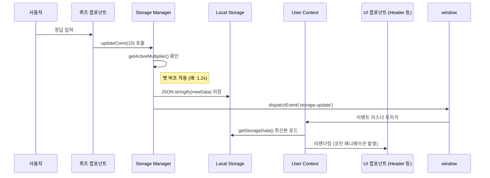

# ⚙️ CORE_LOGIC (핵심 비즈니스 로직 - Deep Dive)

## 1. 학습 보상 파이프라인 (The Reward Loop)
매쓰 펫토리는 사용자의 학습 동기를 유발하기 위해 '버프 기반 보상 시스템'을 채택하고 있습니다.

### 🔄 데이터 흐름 순서 (Sequence)
1.  **이벤트 발생**: 사용자가 퀴즈(`MathQuiz`) 정답을 맞춤.
2.  **보상 요청**: `updateCoins(10)` 함수 호출.
3.  **버프 계산**: `getActiveMultiplier()`가 현재 활성화된 펫 버프를 확인.
    - 버프 조건: 펫에게 간식을 준 후 30분 동안 지속.
    - 공식: `Base(1.0) + (활성 펫 수 * 0.2)`, 최대 **2.0x**.
4.  **저장소 갱신**: 최종 코인을 계산하여 `localStorage`에 저장.
5.  **상태 전파**: `window.dispatchEvent`를 통해 `storage-update` 커스텀 이벤트 발생.
6.  **UI 동기화**: `UserContext`가 이벤트를 수신하여 전역 `userData`를 갱신, 모든 UI(헤더의 코인 표시 등)가 즉시 업데이트됨.

### 📊 시퀀스 다이브 (Mermaid)

## 2. 핵심 알고리즘: 펫 버프 시스템
- **설계 의도**: 사용자가 단순히 문제만 푸는 것이 아니라, 펫을 관리(Feeding)하는 행위가 학습의 이득으로 돌아오게 함으로써 '학습-펫 케어' 간의 유기적 결합 유도.
- **구현 특징**:
    - `activeBuffs` 객체에 `petId: expiryTimestamp` 형태로 저장하여 정밀한 시간 기반 만료 처리.
    - `Math.min(2.0, ...)`를 통해 보상 밸런스가 붕괴되지 않도록 상한선 설정.

## 3. 예외 처리 및 확장 전략
- **데이터 마이그레이션**: `getStorageData` 호출 시 이전 버전의 `foodInventory` 형식을 현재의 `snack` 통합 형식으로 자동 변환하여 데이터 유실 방지.
- **동기화 전략**: React Context 내부에만 상태를 두지 않고 `localStorage`를 Source of Truth로 삼아, 페이지 새로고침이나 다중 탭 환경에서도 데이터 일관성 유지.
- **컴포넌트 독립성**: `storageManager`는 순수 자바스크립트 함수로 구성되어 있어, React 컴포넌트 외부(예: SEO 스크립트 등)에서도 동일한 로직으로 데이터 접근 가능.

## 4. 의존성 관계
- **내부**: `UserContext` -> `storageManager` -> `localStorage`.
- **외부**: `canvas-confetti` (시각적 피드백), `framer-motion` (UI 전환 효과).
