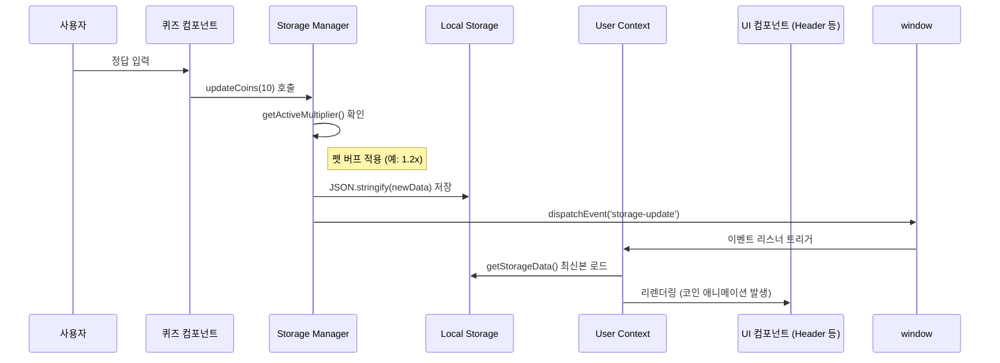

# ⚙️ CORE_LOGIC (핵심 비즈니스 로직 - Deep Dive)

## 1. 학습 보상 파이프라인 (The Reward Loop)
매쓰 펫토리는 사용자의 학습 동기를 유발하기 위해 '버프 기반 보상 시스템'을 채택하고 있습니다.

### 🔄 데이터 흐름 순서 (Sequence)
1.  **이벤트 발생**: 사용자가 퀴즈(`MathQuiz`) 정답을 맞춤.
2.  **보상 요청**: `updateCoins(10)` 함수 호출.
3.  **버프 계산**: `getActiveMultiplier()`가 현재 활성화된 펫 버프를 확인.
    - 버프 조건: 펫에게 간식을 준 후 30분 동안 지속.
    - 공식: `Base(1.0) + (활성 펫 수 * 0.2)`, 최대 **2.0x**.
4.  **저장소 갱신**: 최종 코인을 계산하여 `localStorage`에 저장.
5.  **상태 전파**: `window.dispatchEvent`를 통해 `storage-update` 커스텀 이벤트 발생.
6.  **UI 동기화**: `UserContext`가 이벤트를 수신하여 전역 `userData`를 갱신, 모든 UI(헤더의 코인 표시 등)가 즉시 업데이트됨.

### 📊 시퀀스 다이브 (Mermaid)

## 2. 핵심 알고리즘: 펫 버프 시스템
- **설계 의도**: 사용자가 단순히 문제만 푸는 것이 아니라, 펫을 관리(Feeding)하는 행위가 학습의 이득으로 돌아오게 함으로써 '학습-펫 케어' 간의 유기적 결합 유도.
- **구현 특징**:
    - `activeBuffs` 객체에 `petId: expiryTimestamp` 형태로 저장하여 정밀한 시간 기반 만료 처리.
    - `Math.min(2.0, ...)`를 통해 보상 밸런스가 붕괴되지 않도록 상한선 설정.

## 3. SEO 자동화 및 실시간 인덱싱 (SEO Automation)
매쓰 펫토리는 콘텐츠의 검색 가시성을 극대화하기 위해 다층적 SEO 자동화 시스템을 구축하고 있습니다.

### 🔄 SEO 파이프라인 흐름
1.  **데이터 정의**: `src/data/seoData.js`에서 모든 서비스 경로의 메타데이터(Title, Desc, Priority 등)를 관리합니다. (Source of Truth)
2.  **정적 자산 생성**: `scripts/generate-seo.js`를 통해 빌드 타임에 `sitemap.xml`, `rss.xml`, `robots.txt`를 생성합니다.
3.  **IndexNow 전송**: 생성된 URL 리스트를 Bing, Naver 등의 IndexNow 엔드포인트에 즉시 전송합니다.
4.  **Google Indexing API 호출**: `scripts/google-indexing.js`를 통해 Google Search Console에 실시간 색인 요청을 보냅니다.

### 🛠️ 구현 특징
- **중앙 집중식 관리**: 페이지 추가 시 `seoData.js`만 업데이트하면 모든 SEO 자산과 인덱싱 요청이 자동으로 처리됩니다. `index.html`은 최소한의 구조만 유지하며, 모든 메타 태그는 `SEOHead` 컴포넌트를 통해 런타임에 동적으로 주입하여 중복 발생을 원천 차단합니다.
- **보안 및 이식성**: 민감한 API 키(`google-indexing-key.json`)는 프로젝트 루트에 보관하되 `.gitignore`로 제외하여 보안을 유지하며, 스크립트 내에서 상대 경로를 통해 유연하게 참조합니다.

## 4. 예외 처리 및 확장 전략
- **데이터 마이그레이션**: `getStorageData` 호출 시 이전 버전의 `foodInventory` 형식을 현재의 `snack` 통합 형식으로 자동 변환하여 데이터 유실 방지.
- **동기화 전략**: React Context 내부에만 상태를 두지 않고 `localStorage`를 Source of Truth로 삼아 일관성 유지.
- **확장성**: `scripts/google-indexing.js`는 `googleapis`를 사용하여 구현되었으며, 일일 할당량(200회) 초과 시 자동으로 중단되는 방어 로직이 포함되어 있습니다.

## 5. 의존성 관계
- **내부**: `UserContext` -> `storageManager` -> `localStorage`.
- **자동화**: `scripts/` 내 도구들은 `googleapis`를 통해 외부 검색 엔진 API와 통신합니다.
- **외부**: `canvas-confetti` (시각적 피드백), `framer-motion` (UI 전환 효과).
