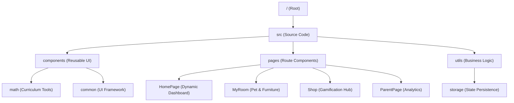

# 🗺️ SYSTEM_MAP (프로젝트 구조 지도)

## 🏗️ 서비스 개요
- **서비스명**: 매쓰 펫토리 (Math Petory)
- **목적**: 초등 수학 원리 학습 및 펫 키우기 게임화(Gamification) 플랫폼
- **도메인**: [https://math.lego-sia.com](https://math.lego-sia.com)

## 🛠️ 기술 스택
| 구분 | 기술 |
| :--- | :--- |
| **Framework** | React 18 (Vite) |
| **Styling** | Vanilla CSS (CSS Modules) |
| **Animation** | Framer Motion, canvas-confetti |
| **Visuals** | Three.js (@react-three/fiber), Recharts |
| **Icons** | Lucide React |
| **Deployment** | Vercel |
| **SEO** | custom scripts (Sitemap, RSS, IndexNow, Google Indexing) |

## 📁 디렉토리 구조 (핵심)

### 1. `src/` (주요 로직)
- `App.jsx`: 메인 라우팅 (Home, Selection, Curriculum, MyRoom, Shop, Parent 등)
- `pages/HomePage.jsx`: 사용자 레벨, 뱃지, 랭킹 정보를 담은 대시보드형 메인
- `pages/MyRoom.jsx`: 가구 배치 시스템 및 펫 인터랙션 구현
- `pages/ParentPage.jsx`: Recharts 기반의 학습 데이터 시각화 리포트
- `utils/storage/storageManager.js`: XP, 코인, 인벤토리, 레이아웃 등 모든 상태의 영속성 관리 (URL Sync 포함)

### 2. `scripts/` (자동화)
- `generate-seo.js`: 빌드 시 `sitemap.xml`, `rss.xml`, `robots.txt`를 자동 생성하고 IndexNow에 제출함.
- `google-indexing.js`: Google Indexing API를 통해 실시간 색인 요청을 보냄.
- `update-seo-descriptions.js`: 대규모 SEO 메타데이터 업데이트 스크립트.

## 🔗 외부 연동 정보
- **IndexNow Key (Bing)**: `bbd0d9a6843c450eb3e9d811a0fd504a`
- **IndexNow Key (Naver)**: `7c007da9c90cef3f9485956806191b31`
- **Indexing API**: Google Indexing API, Bing IndexNow, Naver Search Advisor
- **Google Service Account**: `google-indexing-bot@lego-sia-index.iam.gserviceaccount.com`

## 🛡️ 가동 원칙
1. 모든 페이지 추가 시 `src/data/seoData.js`에 먼저 등록할 것.
2. 빌드 전 `npm run index` 또는 `npm run build`를 통해 SEO 정보를 갱신할 것.
3. `index.html`은 최소한의 셸 구조만 유지하며, 정적인 메타 설명(Description) 태그를 직접 삽입하지 말 것 (SEOHead 컴포넌트와 충돌 방지).
