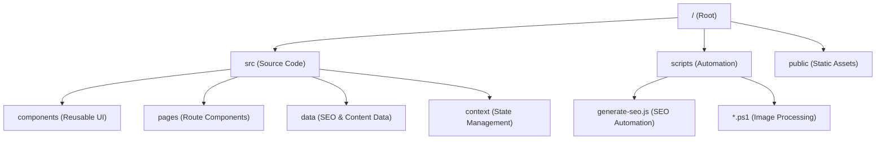

# 🗺️ SYSTEM_MAP (프로젝트 구조 지도)

## 🏗️ 서비스 개요
- **서비스명**: 매쓰 펫토리 (Math Petory)
- **목적**: 초등 수학 원리 학습 및 펫 키우기 게임화(Gamification) 플랫폼
- **도메인**: [https://math.lego-sia.com](https://math.lego-sia.com)

## 🛠️ 기술 스택
| 구분 | 기술 |
| :--- | :--- |
| **Framework** | React 18 (Vite) |
| **Styling** | Vanilla CSS (CSS Modules 추정) |
| **Animation** | Framer Motion |
| **Icons** | Lucide React |
| **Deployment** | Vercel |
| **SEO** | custom scripts (Sitemap, RSS, IndexNow) |

## 📁 디렉토리 구조

### 1. `src/` (주요 로직)
- `App.jsx`: 메인 라우팅 및 레이아웃 정의
- `data/seoData.js`: 서비스 내 모든 페이지의 SEO 메타데이터 관리 (Source of Truth)
- `pages/`: 학년별 수학 학습 및 펫 관리 UI

### 2. `scripts/` (자동화)
- `generate-seo.js`: 빌드 시 `sitemap.xml`, `rss.xml`, `robots.txt`를 자동 생성하고 IndexNow에 제출함.
- `update-seo-descriptions.js`: 대규모 SEO 메타데이터 업데이트 스크립트.
- `*.ps1`: 이미지 배경 제거 및 자동화 처리를 위한 PowerShell 스크립트들.

## 🔗 외부 연동 정보
- **IndexNow Key (Bing)**: `bbd0d9a6843c450eb3e9d811a0fd504a`
- **IndexNow Key (Naver)**: `7c007da9c90cef3f9485956806191b31`
- **Indexing API**: Bing, IndexNow.org, Naver Search Advisor

## 🛡️ 가동 원칙
1. 모든 페이지 추가 시 `src/data/seoData.js`에 먼저 등록할 것.
2. 빌드 전 `npm run indexnow` 또는 `npm run build`를 통해 SEO 정보를 갱신할 것.
